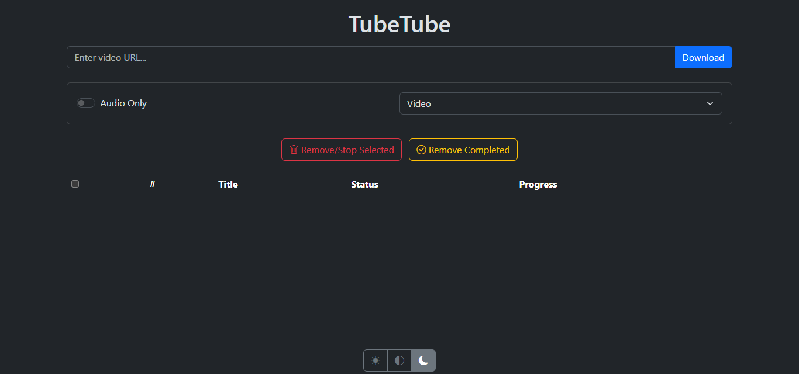

**TubeTube** is a simple YouTube downloader.


## Features:
- **Multithreaded Downloads:** Fast, simultaneous downloads.
- **Custom Locations & Formats:** YAML-based settings.
- **Mobile Optimized:** Designed for small screens.
- **Download Options:** Choose between audio or video.
- **Live Video Support:** Supports multiple live streams.


## Docker Compose Configuration

Create a `docker-compose.yml` file:

```yaml
services:
  tubetube:
    image: ghcr.io/mattblackonly/tubetube:latest
    container_name: tubetube
    ports:
      - 6543:6543
    volumes:
      - /path/to/general:/data/General
      - /path/to/music:/data/Music
      - /path/to/podcasts:/data/Podcast
      - /path/to/videos:/data/Video
      - /path/to/config:/config
      - /path/to/temp:/temp # Optional. Temp files are deleted on startup.
      - /etc/localtime:/etc/localtime:ro # Optional. Sync time with host.
      - /etc/timezone:/etc/timezone:ro # Optional. Sync timezone with host.
    environment:
      - THREAD_COUNT=1
      - PUID=1000
      - PGID=1000
    restart: unless-stopped
```


## Directory Configuration

Create a `settings.yaml` file in the `/path/to/config` directory with the following format:

```yaml
General:
  audio_ext: m4a
  audio_format_id: '140'
  video_ext: mp4
  video_format_id: '625'
Music:
  audio_ext: mp3
  audio_format_id: '140'
Podcast:
  audio_ext: m4a
  audio_format_id: '140'
Video:
  audio_format_id: '140'
  video_ext: mp4
  video_format_id: '625'

```


### Notes:

- Replace `/path/to/general`, etc.. with actual paths on your host machine.
- Ensure the `settings.yaml` file is correctly placed in the `/path/to/config` directory.
- The volume paths in the `docker-compose.yml` file should match the names specified in the settings.yaml file (e.g., /data/**General**, etc..).
- You can create as many directory locations as needed in `settings.yaml`, but each must be mapped individually in `docker-compose.yml`.
- To use a cookies file, create a `cookies.txt` file and place it in the config directory.


## Environment Variable Configuration

Customize the behavior of **TubeTube** by setting the following environment variables in your `docker-compose.yml` file:

```yaml
environment:
  - VERBOSE_LOGS=false        # Enable verbose logging for yt-dlp (default: false)
  - TRIM_METADATA=false       # Trim metadata from files (default: false)
  - PREFFERED_LANGUAGE=en     # Desired language for downloads (default: en)
  - PREFERRED_AUDIO_CODEC=aac # Desired audio codec (default: aac)
  - PREFERRED_VIDEO_CODEC=vp9 # Desired video codec (default: vp9)
  - PREFERRED_VIDEO_EXT=mp4   # Preferred video file extension (default: mp4)
  - THREAD_COUNT=4            # Number of threads for processing (default: 4)
```

## Screenshots

### Phone (Dark Mode)


### Desktop (Dark Mode)




## Star History

<a href="https://star-history.com/#mattblackonly/tubetube&Date">
 <picture>
   <source media="(prefers-color-scheme: dark)" srcset="https://api.star-history.com/svg?repos=mattblackonly/tubetube&type=Date&theme=dark" />
   <source media="(prefers-color-scheme: light)" srcset="https://api.star-history.com/svg?repos=mattblackonly/tubetube&type=Date" />
   
 </picture>
</a>
